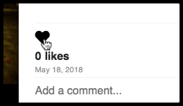
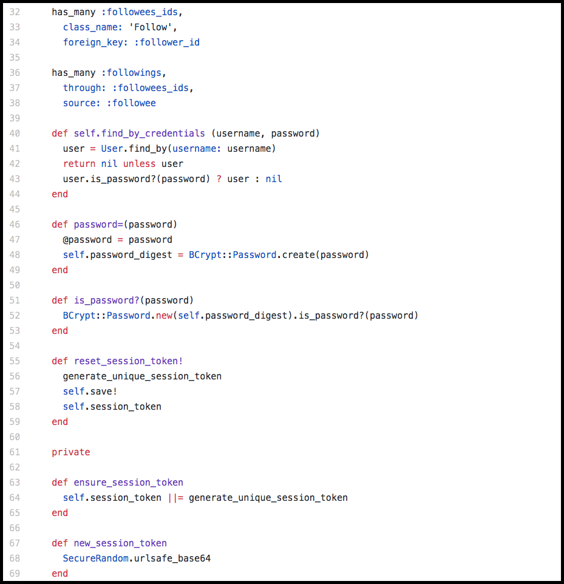
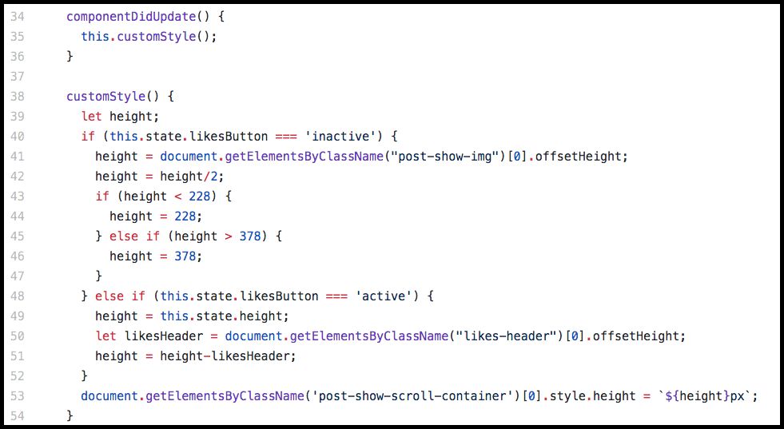

# Definitely Not Instagram
[Live Link!](https://definitely-not-instagram.herokuapp.com/#/)

Note - The application is hosted in Heroku which puts the application in sleep if not visited for a while. Thus visiting the link at first might take longer than ususal. In the near future, I intend to incorporate Uptime Robot to fix this situation.

**_If you find a bug or have a recommendation to make this application better, please contact me through GitHub or my email, arittrosaha@gmail.com. Thank you very much!_**

---
## Summary
**Synopsis** - Definitely Not Instagram is a full stack web application inspired by Instagram. It is built with a Ruby on Rails backend,  PostgreSQL database and React with a Redux architectural framework on the frontend.

**Stack** - Ruby on Rails, PostgreSQL, React.js, Redux.js, JS-ES6, HTML5, CSS3, AWS S3, Heroku.

**Key Points**:
* Leveraged Bcrypt gem to securely hash user passwords, ensuring protected authentication.
* Implemented Rails polymorphic associations for likes on posts and comments.
* Employed CSS3 flexbox and z-index and React-Modal for a compelling and flexible layout.
* Built responsive design for posts based on respective image dimension using custom JS function.
* Ensured calls to the database run asynchronously through the use of AJAX and Thunk middleware.
* Eager loaded associate user data, at time of log in, to minimize AJAX queries.
* Integrated Paperclip gem for image uploading and stored uploads on AWS S3 while saving their references in PostgreSQL database.
* Optimized code by creating reusable, DRY React components to improve maintainability and scalability.
* Utilized Redux and jBuilder to store fetched data and receive backend JSON response, respectively, in client side.

---
## Current Features
#### Authentication / Landing page
* Sign up for a new account with a email, name, username and password.
* Log in to their account with their username and password.
* Log in with a demo user account.
* Receive errors for the following issues:
  * Password length is not greater or equal to six characters.
  * One of the field is missing.
  * Email is not in a valid email format.

#### Home
* Scroll through, in reverse-chronological order/ newest first, a list of user's own posts and their following users' posts with their respective information.
* Interact with each post's relevant options.

#### Profile
* See user information, profile picture and posts on user profile page.
* Change their profile picture by clicking their profile picture on their profile page when logged in.
* Edit Name, Username, Bio, Email of logged in user.

#### Posts
* Post an image with or without a caption.
* Delete a post.
* See the date of a post.
* Click individual post on user's profile to see post and its relevant information.
* Click user profile picture or username to go their profile page.
* Receive error if image is missing.

#### Likes
* Like a post.
* Unlike a post.
* See the number of likes along with UI to indicate if user liked the post.

#### Comments
* Comment on posts.
* Delete any comments under your posts and only user's own comments on a different user's post.
* Scroll through comments under posts.
* Receive errors is user wants to create a comment without any text.

#### Follows
* Follow a user.
* Unfollow a user.
* See the number of followers and followings of a user in their profile page.

---
## Bugs
#### Features currently worked on
 * When followers count is clicked, there will be a list of clickable followers that will navigate to their respective user profile.
 * When followings count is clicked, there will be a list of clickable followings that will navigate to their respective user profile.
 * When likes count is clicked, there will be a list of clickable likers that will navigate to their respective user profile.
 * Search bar to search any users.

#### Current bugs
 * Comments are not wrapping around based on the width of a post's width.
 * When a comment is entered without any text, the error is displayed in all posts viewed in the feed.

#### Features that are displayed but currently not working
* Search bar
* Notification button
* Discover button
* Saved post button

---
## Current Technologies
#### [Backend](https://github.com/arittrosaha/DefinitelyNotInstagram/tree/master/app)

The app was built using Ruby on Rails on the back end with a PostgreSQL database. Back end structure is RESTful and all the data requests use AJAX and are fulfilled with a JSON API. Associations are used to prefetch data in order to minimize SQL queries to the database.

Languages:
* Ruby
* SQL

Notable Gems:
* rails - Ruby on Rails for a MVC backend
* pg - PostgreSQL for database.
* bcrypt - to securely hash and salt user passwords.
* paperclip - for file uploading.
  * Note - This gem has been depricated. In the near future, the app will be transitioned to Active Storage.
* jQuery Rails - for the use of ajax calls and respective promises.
* aws-sdk - for utilizing Amazon Web Service's(AWS) S3 for storing user profile picture and uploads in a scalable manner.

A code snippet from backend of User modal:

* Line 32 to 38 - An example of the many rails associations I created to relate my tables, stored in my PostgreSQL server, through their respective indexed foreign keys.
* Line 40 to 53 - A portion of the code to check and create password by leveraging Bcrypt gem to securely hash and salt user passwords to ensure protected authentication.
* Line 55 to 69 - A portion of the code to generate (by using rails Secure, reset and ensure session_token for handling a user's logged in sessions.

#### [Frontend](https://github.com/arittrosaha/DefinitelyNotInstagram/tree/master/frontend)

The front end is built completely in React.js and in conjunction with Redux clientside storage. React's virtual DOM allows and diffing algorithm for lightning-quick and efficient rerendering without requiring new pages to be sent from the server. Even modals appear/disappear using React rather than toggling CSS display properties.

Languages:
* JavaScript ES6
* HTML5
* CSS3

Notable npm packages:
* React and other relevant React npm packages.
* Redux and other relevant Redux npm packages.
* Webpack and other relevent Webpack npm packages.
* Babel and other relevent Babel npm packages.
* Lodash

A code snippet from frontend (particularly from the post_show component). It is a custom JS function to build responsive design for posts based on respective image dimension:

---
## Future Technologies
* Uptime Robot - to keep the application awake in Heroku servers.
* pg-search - to search the database for users
* Active storage - to replace Paperclip.
* WebSocket - for real time notification and direct messaging.

---
## Future Features 
Note - The following list is listed in order of importance.

#### Infinite Scroll
* In a **user profile**, only 12 posts will be displayed at first. As user scrolls to the bottom of the page, 12 more posts will be loaded and so on...
* In the **home feed**, only 10 posts will be displayed at first. As user scrolls to the bottom of the page, 10 more posts will be loaded and so on...

#### Authentication / Landing page
* Continuous animation with the phone's screen continuosly changing.
* Circle check or cross animation on right of each field depending on relevant errors or lack their of.

#### Home
* Expand the right user box to contain scrollable list of user's followings which will be clickable to take them to the respective users' profile page.

#### Likes-Comments
* Individual comments can be liked and unliked with a visible counter that can be clickable to display a list of likers.

Note - The backend required for this to happend exists already with polymorphic association between posts and comments for likes.

#### Discover
* Create a discover page which will display a list of most liked posts from the past three months of not followed user's who are followed by your followings.

#### Notification
* Create a realtime notification system for the following events:
  * Another user liked your post.
  * Another user commented on your post.
  * Another user followed you.

#### Password
* Change password
* More restrictions to have stronger password:
  * A minimum of eight characters.
  * At least one uppercase letter and one lowercase letter.
  * At least one number.
  * At least one special character.

#### Multiple media in one post
* User can upload multiple media (images or videos) in one post which can be nagivated from right to left or left to right with respective buttons on left and right side of post.

#### Hashtags
* User can add hashtags on their posts.
* User can search hashtags in the search bar and find other posts with same hashtags.

#### Video
* User can upload videos of at most three minutes long.
* Can be played or paused.
* User can seek through a video.
* User can adjust and mute/unmute volume.

#### Stories
* People can upload short video(s) of at most one and a half minute.
* User, for their own stories, will have the option when clicked will automatically pause the video (if playing) and show a list of users who watched the story over the still video.
* User will be able to navigate between stories from a given user through button on left and right side of stories.
* User will be able to navigate between different users when displaying stories through another set of buttons.
* Home page's right box will be repurposed to display following users' stories.

#### Messaging
* There will be another button on the right side of the top bar which will take them to the messaging page.
* User will be able to send and receive direct messages from other users who are following each other.
* User will be able to scroll through messages to and from a given user.
  * Only certain amount of messages will be displayed by default. Upon scrolling upward more previous messages will be downloaded and displayed.
* User will be able to scroll through a list of users with whom messages have been exchanged in the past.
  * User can click one of the users from this list to display messages between them.
